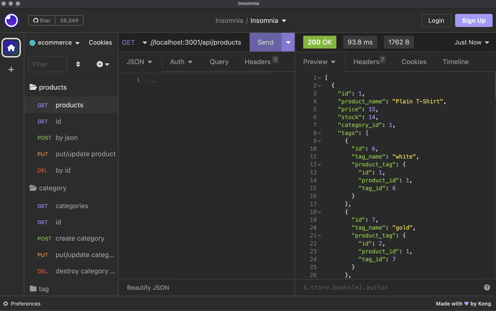

# ecommerce-backend

## Description

This is the back end for an e-commerce site. It uses a Express.js API and is configured to use Sequelize to interact with a MySQL database.

## Installation

### Prerequisites-local machine

This CLI app uses Node.js, Insomnia and MySQL so you will need to install all of these.

## Usage

**Project setup**

- Clone down this repository locally
  `git clonegit@github.com:westgards/ecommerce-backend.git`
- You will need to install
  - `nvm`
  - `npm`
  - `mysql`
  - `express.js`
  - `dotenv`
- Setup a mysql database
- Use the `.env.EXAMPLE` file an setup your credentials
- login to `mysql`
  - create schema: `mysql -u root -p`
  - `SOURCE db/schema.sql`
  - exit mysql
- in Terminal:
  - seed database `node seeds/index.js`
  - start app server `npm start`

\*_Use the command to run the app_
`node server.js`

- Open Insomnia to make requests

## DEMO VIDEO [LINK](https://watch.screencastify.com/v/fSl3A9L45PUm8gb0wakj)

## Credits

Tutorials:

- [U of MN Coding Bootcamp Link](https://github.com/coding-boot-camp)
